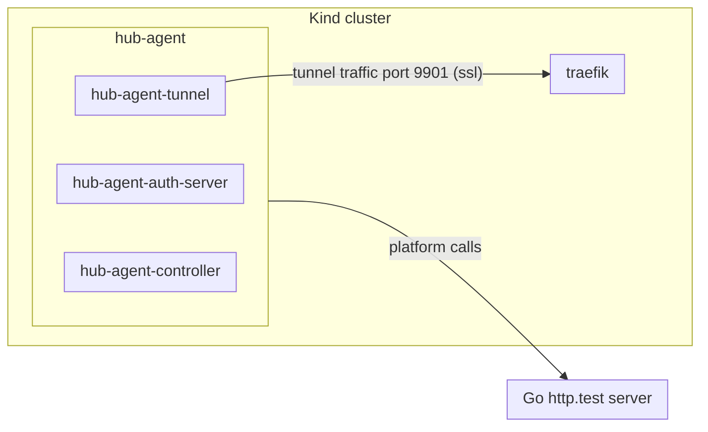
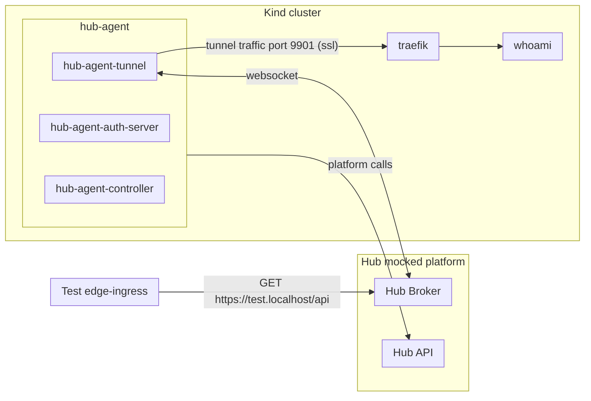

# Architecture

## Initial state

```mermaid
graph LR
 subgraph go-http["Go http.test server"]
 end
 subgraph "Kind cluster"
  subgraph "traefik"
  end
  subgraph "hub-agent"
    subgraph hub-agent-controller
    end
    subgraph hub-agent-auth-server
    end
    subgraph hub-agent-tunnel
    end
  end
 end

hub-agent -->|"platform calls" | go-http
hub-agent-tunnel -->|"tunnel traffic port 9901 (ssl)"| traefik
```

## EdgeIngress

```mermaid
graph LR
 subgraph hub-mock["Hub mocked platform"]
  subgraph hub-api["Hub API"]
  end
  subgraph hub-broker["Hub Broker"]
  end
 end
 subgraph call-hub-broker["Test edge-ingress"]
 end
 subgraph "Kind cluster"
  subgraph "traefik"
  end
  subgraph "hub-agent"
    subgraph hub-agent-controller
    end
    subgraph hub-agent-auth-server
    end
    subgraph hub-agent-tunnel
    end
  end
  subgraph "whoami"
  end
 end

hub-agent -->|"platform calls" | hub-api
hub-agent-tunnel -->|"tunnel traffic port 9901 (ssl)"| traefik
call-hub-broker --> |"GET https://test.localhost/api" | hub-broker
hub-agent-tunnel <--> |"websocket"| hub-broker
traefik --> whoami
```
